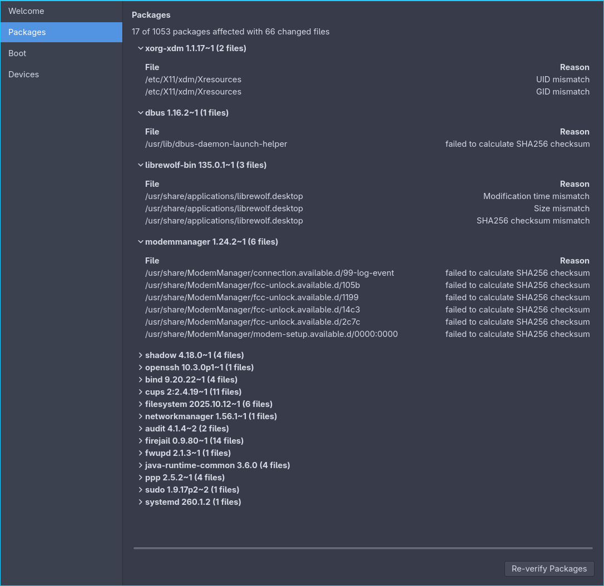

# System Integrity Check

GTK4 application to validate the integrity of packages, boot setup, and devices.



## Views

| View     | Requirements                                                     | Description                                          | Ready? |
|:---------|:-----------------------------------------------------------------|:-----------------------------------------------------|--------|
| Antiques | (Packages and Services requirements)                             | Integrity Check for dependencies of running services |        |
| Boot     | `bootctl`, `mkinitcpio`                                          | Integrity Check for boot betup                       | yes    |
| Drives   | `df`                                                             | Integrity Check for mounts and hard drives           |        |
| Packages | Either of `apk`, `apt`, `dnf`, `pacman`, `rpm`, `tdnf`, `zypper` | Integrity Check for packages                         | yes    |
| Programs | `ldd`, `/proc`                                                   | Integrity Check for running programs                 |        |
| Services | `ldd`, `/proc`                                                   | Integrity Check for running services                 |        |
| System   | `coreutils`, `/etc`, `/sys`                                      | Integrity Check for system-wide configurations       |        |
| Users    | `shadow`, `systemd`                                              | Integrity Check for system-wide user accounts        |        |

## Build

```bash
# Requirements: Go 1.26+, GTK 4.22+ development headers
make build;
```

## Install

```bash
sudo make install;
```

## Tests

### Unit tests

```bash
make test;
```

Runs the host-side unit tests for `types`, `structs`, and `caches` - including
every `types.PackageVerificationIssue` enum value and its remediation mapping.
No package manager or container required.

### Container integration tests

```bash
# Requirements: podman
make test-integration;
```

Builds the correctly tagged test binaries on the host, ships them into podman
containers, and validates the Package index and the PackageVerification index.

Each `Dockerfile.*` installs `openssh` and then tampers with its files
(content edit, `chmod`, `chown`, `chgrp`, `truncate`, `rm`, `touch`, symlink
rewrite) so the container itself ships the integrity violations. The tagged
test binary detects them and asserts the expected
`types.PackageVerificationIssue` enum for each tampered file.

| Action                 | Adapter  | Manager       | Build tags                                                                            | Container image                        |
|:-----------------------|:---------|:--------------|:--------------------------------------------------------------------------------------|:---------------------------------------|
| `CollectPackages`      | `pacman` | `pacman`      | `antergos`, `archlinux`, `manjaro`                                                    | `archlinux`                            |
| `CollectVerifications` | `pacman` | `pacman`      | `antergos`, `archlinux`, `manjaro`                                                    | `archlinux`                            |
| `CollectPackages`      | `apt`    | `apt`         | `debian`, `linuxmint`, `trisquel`, `ubuntu`                                           | `ubuntu:24.04`                         |
| `CollectVerifications` | `apt`    | `apt`         | `debian`, `linuxmint`, `trisquel`, `ubuntu`                                           | `ubuntu:24.04`                         |
| `CollectPackages`      | `rpm`    | `rpm`         | `redhat`, `centos`, `oraclelinux`, `almalinux`, `rockylinux`, `fedora`, `amazonlinux` | `registry.fedoraproject.org/fedora:41` |
| `CollectVerifications` | `rpm`    | `rpm` / `dnf` | `redhat`, `centos`, `oraclelinux`, `almalinux`, `rockylinux`, `fedora`, `amazonlinux` | `registry.fedoraproject.org/fedora:41` |
| `CollectVerifications` | `rpm`    | `zypper`      | `opensuse`, `suse_desktop`, `suse_server`                                             | `registry.opensuse.org/opensuse/leap`  |

The verification adapters map every native status string/flag back to the
package-manager-agnostic [PackageVerificationIssue](./types/PackageVerificationIssue.go)
enum.

## License

[AGPL-3.0](./LICENSE)

